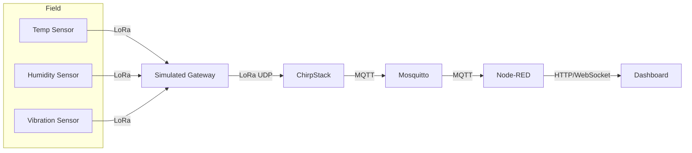

# Industrial IoT (LoRaWAN) Mini-Project

This repository contains everything needed to simulate an Industrial IoT (IIoT) monitoring solution using LoRaWAN. The stack combines:

- **LWN Simulator** for virtual gateways/devices
- **ChirpStack** (network + application servers)
- **Mosquitto** MQTT broker
- **Node-RED** for processing, dashboarding, and alerting

## Target architecture



## Repository layout

```
README.md                      -> quick start instructions
infrastructure/
  docker-compose.yml           -> ChirpStack + Mosquitto stack
  env.template                 -> environment defaults used by compose
  mosquitto.conf               -> broker configuration
flows/
  factory-iiot-flow.json       -> Node-RED dashboard & processing flow
docs/
  simulator-setup.md           -> LWN simulator configuration guide
  presentation-outline.md      -> structure for the final report/slides
```

## Prerequisites

1. **Docker Desktop** with Compose v2 (WSL2 backend recommended) and ≥4 GB RAM.
2. **Node.js 18+** (ships with `npx node-red`) or a Node-RED Docker image.
3. **Git** to clone this repository (and the simulator during the build).
4. Optional: **mosquitto-clients** for quick MQTT tests (or exec into the Mosquitto container).

## Installation & run guide

> Commands assume Windows PowerShell / CMD from the repo root (`C:\Users\…\NodeRed`). Adjust paths as needed.

### 1. Clone the repo & prepare environment

```cmd
git clone <your-repo-url> NodeRedProject
cd NodeRedProject
copy infrastructure\env.template infrastructure\.env
```

### 2. Start the core stack (Postgres + Redis + ChirpStack + Mosquitto)

```cmd
docker compose -f infrastructure\docker-compose.yml up -d
```

Verify via `docker compose -f infrastructure\docker-compose.yml ps` and by visiting `http://localhost:8080` (default login `admin/admin`).

### 3. Build the LWN Simulator (containerized Go build)

```cmd
docker compose -f infrastructure\docker-compose.yml --profile builder run --rm lwn-builder
```

The first run pulls the Go toolchain, clones `UniCT-ARSLab/LWN-Simulator`, and outputs binaries to `third_party\LWN-Simulator\bin` (both Linux and Windows executables).

### 4. Launch the simulator & configure gateway/devices

```powershell
cd third_party\LWN-Simulator\bin
./lwnsimulator.exe
```

Simulator UI: `http://localhost:8000`

1. Add a gateway pointing to `127.0.0.1:1700` (UDP forwarder toward ChirpStack Gateway Bridge).
2. Add/import devices; capture DevEUI / JoinEUI / AppKey (use MSB form when registering in ChirpStack).
3. Start the simulation when ChirpStack devices are ready (AutoStart optional).

### 5. Configure ChirpStack (application + OTAA devices)

1. Applications → Create (e.g., `factory-floor`).
2. For each simulator device: Create Device → OTAA → paste DevEUI / JoinEUI / AppKey → Save.
3. Optionally set payload codecs or keep the default (Node-RED flow decodes the JSON payloads published by ChirpStack).

### 6. Start Node-RED and import the flow

```powershell
npx node-red
```

In `http://localhost:1880`: Import → select `flows/factory-iiot-flow.json` → Deploy. The dashboard lives at `http://localhost:1880/ui`.

### 7. Validate telemetry end-to-end

- ChirpStack “Live LoRaWAN frames” shows join-accepts + uplinks.
- MQTT spot-check (inside Mosquitto container):
  ```cmd
  docker compose -f infrastructure\docker-compose.yml exec mosquitto ^
    mosquitto_sub -h mosquitto -t "application/#" -v
  ```
- Node-RED dashboard tiles update and raise the alarm toast when temperature > 60 °C.
- Capture screenshots (ChirpStack, simulator, Node-RED dashboard) for the final deliverables.

## Verification checklist

- [ ] Devices successfully join in ChirpStack (Live LoRaWAN Frames view).
- [ ] MQTT messages arrive on `application/+/device/+/event/up` when using `mosquitto_sub`.
- [ ] Node-RED dashboard displays temperature, humidity, vibration values, and alarm toast when temp > 60 °C.
- [ ] Screenshots captured for ChirpStack console, MQTT monitor, and Node-RED dashboard for the final presentation.

## Next steps / extensions

- Persist telemetry in InfluxDB or TimescaleDB and build Grafana dashboards.
- Add downlink commands to reconfigure reporting intervals from ChirpStack.
- Deploy the stack to an edge gateway (Raspberry Pi or industrial PC) for field demos.

Refer to the docs folder for detailed simulator configuration and report guidelines.
