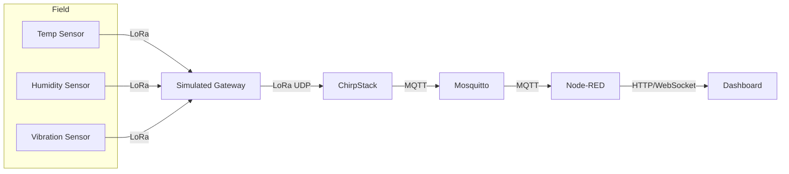

# Industrial IoT (LoRaWAN) Mini-Project

This repository contains everything needed to simulate an Industrial IoT (IIoT) monitoring solution using LoRaWAN. The stack combines:

- **LWN Simulator** for virtual gateways/devices
- **ChirpStack** (network + application servers)
- **Mosquitto** MQTT broker
- **Node-RED** for processing, dashboarding, and alerting

## Target architecture



## Repository layout

```
README.md                      -> quick start instructions
infrastructure/
  docker-compose.yml           -> ChirpStack + Mosquitto stack
  env.template                 -> environment defaults used by compose
  mosquitto.conf               -> broker configuration
flows/
  factory-iiot-flow.json       -> Node-RED dashboard & processing flow
docs/
  simulator-setup.md           -> LWN simulator configuration guide
  presentation-outline.md      -> structure for the final report/slides
```

## Prerequisites

1. **Docker Desktop** (with Compose v2) and at least 4 GB RAM available.
2. **Node.js 18+** (ships with Node-RED CLI) or install Node-RED via Docker.
3. **Java 11+** runtime for the LWN Simulator.
4. **Git** to clone this repository.

## Quick start

1. Clone the repo and copy the env template:
   ```cmd
   git clone <your-repo-url> NodeRed
   cd NodeRed
   copy infrastructure\env.template infrastructure\.env
   ```
2. Start ChirpStack + Mosquitto:
   ```cmd
   docker compose -f infrastructure\docker-compose.yml up -d
   ```
3. Open ChirpStack UI at `http://localhost:8080` (default admin: `admin/chirpstack`).
4. Import the device profile & application as described in `docs/simulator-setup.md`.
5. Download and launch LWN Simulator, then load the config from the same doc.
6. Install/start Node-RED (`npx node-red` or Docker) and import `flows/factory-iiot-flow.json` via the Node-RED editor.
7. Deploy the flow, open the dashboard (`http://localhost:1880/ui`), and observe real-time charts.

## Verification checklist

- [ ] Devices successfully join in ChirpStack (Live LoRaWAN Frames view).
- [ ] MQTT messages arrive on `application/+/device/+/event/up` when using `mosquitto_sub`.
- [ ] Node-RED dashboard displays temperature, humidity, vibration values, and alarm toast when temp > 60 °C.
- [ ] Screenshots captured for ChirpStack console, MQTT monitor, and Node-RED dashboard for the final presentation.

## Next steps / extensions

- Persist telemetry in InfluxDB or TimescaleDB and build Grafana dashboards.
- Add downlink commands to reconfigure reporting intervals from ChirpStack.
- Deploy the stack to an edge gateway (Raspberry Pi or industrial PC) for field demos.

Refer to the docs folder for detailed simulator configuration and report guidelines.
